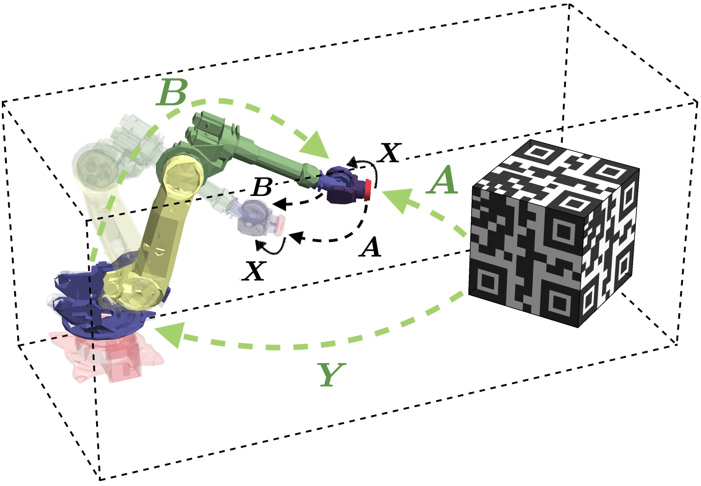

---


# LibQPEP
A library that deals with generalized quadratic pose estimation problems (QPEPs). The algorithm aims to obtain globally optimal pose together with globally optimal covariance estimates. Typically it can solve the following problems:

1. Perspective-n-Points (PnP)

2. Perspective-n-Lines (PnL)

3. Perspective-n-Points and Lines (PnPL)

4. Hand-eye Calibration

5. Point-to-plane Registration

6. Conics-based Camera Pose Estimation

7. Multi-robot relative pose problem from range measurements

8. Forward kinematics of parallel robots

9. Multi-GNSS attitude determination problem



# Authors
Affiliation: **RAM-LAB**, Hong Kong University of Science and Technology (**HKUST**)

Main Contributor: **Jin Wu** (https://github.com/zarathustr), jin_wu_uestc@hotmail.com

Core Contributors: **Xiangcheng Hu** (https://github.com/JokerJohn), **Ming Liu** (https://www.ece.ust.hk/eelium)


# Usage
The C++ codes are built using ```CMake``` toolkit under the ```C++11``` programming standard. The codes have been verified on the ```Ubuntu 14.04/16.04/18.04``` (```GCC``` Compilers 5.0 ~ 10.0), Mac ```OS X 10.5.8/10.6.8/10.7.5/10.8.5/10.9.5/10.10/10.12/10.14/10.15``` (```Clang``` Compilers 3 ~ 11).

In the C++ code, the file ```main.cpp``` contains demos of pose and covariance estimation. The function ```QPEP_grobner``` solves the QPEP via Groebner-basis elimination by Larsson et al. https://github.com/vlarsson. Using ```QPEP_lm_single```, the solved pose will be refined by the Levenberg-Marquadt (LM) iteration. Finally, the function ```csdp_cov``` estimates the covariance information.

## C++ Compilation
```bash
git clone https://github.com/zarathustr/LibQPEP
mkdir build
cd build
cmake ..
make -j4
```

## Dependencies
1. Mandatory dependencies are: ```X11```, ```LAPACK```, ```BLAS```, ```Eigen3```.
2. For Ubuntu users, please follow https://github.com/eddelbuettel/mkl4deb to install Intel ```MKL``` library. 
3. ```OpenCV``` is optional. However, if you need visualization of covariances, OpenCV must be installed. We support ```OpenCV 2.x to 4.x```.

## Demo Program
Just run
```bash
./LibQPEP-test
```

## Library Installation
This depends on the CMake prefix you set by ```-DCMAKE_INSTALL_PREFIX=path_to_your_install```. The standard path is ```/usr/local```. Use ```make install``` to install the headers and libraries along with ```CMake``` and ```pkgconfig``` files.

## MATLAB Demo Kit
The ```MATLAB``` of version over R2007b is required for proper evaluation. The MATLAB demo kit mainly consists of examples showing how QPEPs are constructed and solved. Three files ```syms_hand_eye.m, syms_pnp.m, syms_pTop.m``` contain symbolic generators for expression functions of hand-eye calibration, PnP and point-to-plane registration problems. Two test files ```test_rel_att.m``` and ```test_stewart.m``` illustrate how range-based relative pose problem and the forward kinematics problem of Stewart platform can be transformed into QPEPs. The final three files ```test_cov_hand_eye.m, test_cov_pnp.m``` and ```test_cov_pTop.m``` consist of globally optimal solutions and covariance estimation. The comparison with method of Nguyen et al. is shown in ```nguyen_covariance.m```. This comparison with Nguyen et al. requires installation of ```Python 2.7```. The implementation is ported directly from the original authors' repository https://github.com/dinhhuy2109/python-cope. Users can change the path in the script to choose the proper Python interpreter. In covariance estimation codes of MATLAB, we use the SeDuMi as a general optimizer, since it is free and flexible. 

## Applications (C++ & ROS Codes)
1. Point-to-plane Registration: https://github.com/zarathustr/libpointmatcher_QPEP (Can be used in ROS with https://github.com/ANYbotics/pointmatcher-ros)
2. Perspective-n-Points for SLAM Cloop Closure: https://github.com/zarathustr/DSO-QPEP-Loop-Closure

## Publication
Wu, J., Zheng, Y., Gao, Z., Jiang, Y., Hu, X., Zhu, Y., Jiao, J., Liu*, M. (2020)
           Quadratic Pose Estimation Problems: Globally Optimal Solutions, 
           Solvability/Observability Analysis and Uncertainty Description.
